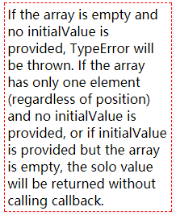
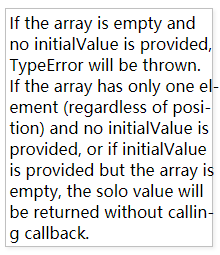

# hyphenjs
> 让英文智能断行并添加连字符，实现齐头尾/两端对齐的效果~~
>
> 如果好用就star和提bug呗~~

> 红框里是浏览器默认的文本排版，右侧会有锯齿（至于难不难看就见仁见智啦哈哈）。后者是使用`hyphen(selecter, true)`后的文本排版，整齐得像一块豆腐块！





## Use

```javascript
/**
 * selector 选择器，只要是querySelectorAll支持的都可以
 * deep 是否强制完美对齐，如果不对齐则会有一定的透气空间
 **/
hyphen(selector, deep);
```


详情参见html里的demo

