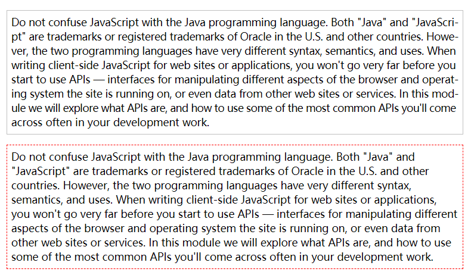

# hyphenjs

A lightweight and compact tool library that make the English text to line up and add simple hyphen to achieve the effect of the justify alignment.



## API Doc

```javascript
new Hyphen({
  // nodeList need render
  el: '.text-js',
  // (left and right) hyphenate control
  leftMin: 2,
  rightMin: 2,
  // move threshold
  move: 8,
  // width precision
  fixed: 3,
  // lifecycle hook
  beforeRender() {}
  afterRender() {}
  render() {}
})
```
